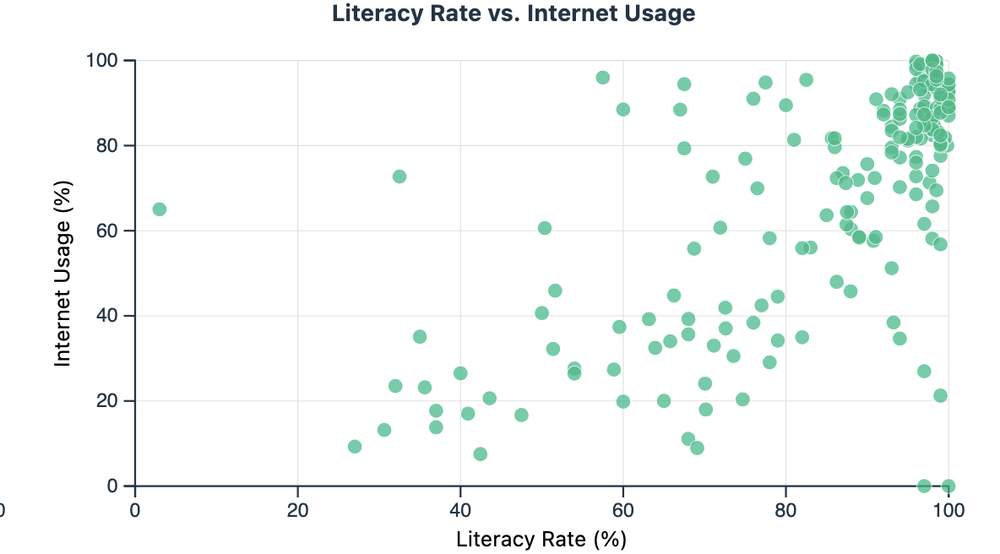
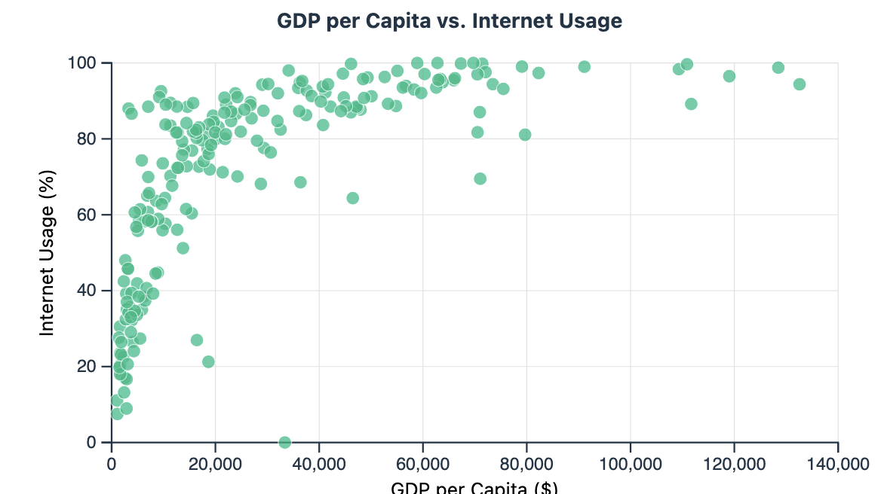
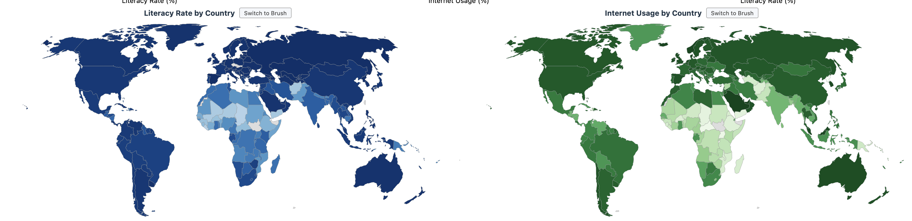

# Project 1 Documentation: Global Development Dashboard

## Motivation

This application helps users explore the relationship between literacy rate, internet usage, life expectancy, and GDP per capita across countries worldwide. The initial motivation was to investigate whether literacy rate and internet usage are closely correlated, and whether any unexpected patterns emerge. The project expanded to include life expectancy and GDP per capita,two indicators of a country's overall health and development,to see how these factors interrelate on a global scale. By presenting multiple coordinated views, users can discover patterns such as which regions lag behind in connectivity despite high literacy, or how economic output relates to life outcomes.

## Data

The data was sourced from [Our World in Data](https://ourworldindata.org) and covers four country-level measures, each using the most recent available year per country (up to 2023):

- **Literacy Rate**,percentage of people aged 15 and older who can read and write a simple sentence about their daily life. [Source](https://ourworldindata.org/grapher/cross-country-literacy-rates)
- **Internet Usage**,share of individuals who used the internet in the last three months. [Source](https://ourworldindata.org/grapher/share-of-individuals-using-the-internet)
- **Life Expectancy**,the number of years the average person born in a given year would live if mortality rates remained constant. [Source](https://ourworldindata.org/grapher/life-expectancy)
- **GDP per Capita**,gross domestic product divided by population, adjusted for inflation and differences in living costs between countries. [Source](https://ourworldindata.org/grapher/gdp-per-capita-maddison-project-database)

Each dataset was downloaded as a CSV. The application loads all four CSVs at runtime and extracts the most recent entry per country (filtering to entries with a valid country code). No offline pre-processing was needed beyond the downloads themselves.

## Sketches

<!-- TODO: Add your design sketches here. Insert images of the layout sketches you created before coding. -->

*Sketches to be added.*

## Visualization Components

The dashboard is a single-page application with five coordinated visualizations arranged in two rows, plus a control bar at the top.

### Controls

At the top of the page, two dropdown selectors let the user choose which attribute to display on the **X-axis / Left Map** and **Y-axis / Right Map**. The four available attributes are Literacy Rate, Internet Usage, GDP per Capita, and Life Expectancy. A **Reset Selection** button clears all active brush selections across every view.

### Histogram (x2)

The top-left and top-center panels each show a **histogram** of one selected attribute. The x-axis represents the attribute value and the y-axis represents the number of countries that fall within each bin (20 bins). Hovering over a bar displays a tooltip with the bin range and count of countries. Users can **brush horizontally** across the histogram to select a range; countries within that range are highlighted across all other views.

### Scatterplot

The top-right panel shows a **scatterplot** correlating the two selected attributes. Each dot represents a country. Hovering over a dot reveals a tooltip with the country name and both attribute values (with years). Users can perform a **2D rectangular brush** to select a subset of countries, which highlights them across all views. Gridlines are drawn for readability.

### Choropleth Maps (x2)

The bottom row displays two side-by-side **choropleth maps** using a Natural Earth projection. The left map encodes the X-axis attribute and the right map encodes the Y-axis attribute. Each map uses a sequential color scale from the `d3-scale-chromatic` library:

- **Literacy Rate**: `d3.interpolateBlues`
- **Internet Usage**: `d3.interpolateGreens`
- **GDP per Capita**: `d3.interpolateOranges`
- **Life Expectancy**: `d3.interpolateReds`

These color schemes were chosen because they are single-hue sequential scales appropriate for quantitative data that ranges from low to high. They are colorblind-friendly and visually distinct from one another so the two maps are easy to tell apart. Countries with no data are shown in light grey.

Each map has two interaction modes toggled by a **Switch to Brush / Switch to Hover** button:

- **Hover mode** (default): hovering a country shows a tooltip with the country name, attribute value, and year.
- **Brush mode**: a 2D rectangular brush selects countries (by centroid) and highlights them across all views.

A color legend beneath each map shows the scale and tick values.

### Brushing & Linking

All five views are coordinated. When the user brushes in any view, the selected set of countries is highlighted in every other view,unselected items fade to low opacity. Multiple brushes can be active simultaneously; the final highlighted set is the **intersection** of all active brushes, allowing users to progressively narrow down to countries that meet criteria across multiple views. The "Reset Selection" button clears all brushes at once.

The design uses **highlight** (dimming non-selected items) rather than **filter** (removing them) so that users maintain context of the full dataset and can see where the selected subset falls relative to the whole. Axis scales remain fixed so that spatial positions are stable during brushing.

## Discoveries

1. **Literacy and internet usage are strongly correlated**,countries with literacy rates above 90% almost universally have internet usage above 50%, forming a tight cluster in the upper-right of the scatterplot. However, several countries with high literacy (near 100%) still have relatively low internet usage, suggesting infrastructure or economic barriers beyond education. Data availability is limited for some countries, which may impact findings.



2. **GDP per capita does not have a logarithmic correlation to internet usage.** When plotting GDP per capita against internet usage, the scatterplot reveals that internet access is far more evenly distributed across countries than GDP is. Many countries with relatively low GDP still have high internet usage rates, showing that internet adoption has spread globally in a way that does not mirror the steep inequality in economic output. This suggests that internet infrastructure has become accessible independently of national wealth.



3. **Sub-Saharan Africa stands out on the maps**,brushing countries with low literacy and low internet usage on the histograms highlights a cluster of Sub-Saharan African nations on both choropleth maps, making the regional pattern immediately visible.



## Process

### Libraries

- **D3.js v7**,used for all data loading (CSV/JSON), scales, axes, binning, geo projection, brushing, and DOM bindings.
- **Vite v7**,development server and build tool.
- **marked v17**,renders this Markdown documentation file into HTML on the docs page.

### Code Structure

```
projects/project-1/
  index.html         ,Main dashboard page
  docs.html          ,Documentation page (renders documentation.md)
  src/
    main.js          ,All visualization logic (histograms, scatterplot, choropleths, brushing & linking)
    docs.js           ,Fetches and renders documentation.md via marked
    style.css         ,All styling for both dashboard and docs pages
  public/
    data/             ,CSV datasets and world GeoJSON
    documentation.md  ,This file
  vite.config.js      ,Vite configuration with base path for GitHub Pages
  package.json        ,Project dependencies and scripts
```

### Running the Project

1. `npm install` in the `projects/project-1/` directory.
2. `npm run dev` to start the Vite dev server.
3. `npm run build` to create a production build.

### Links

- **Live app**: [https://dylfrancis.github.io/visual-interfaces-data/project-1/](https://dylfrancis.github.io/visual-interfaces-data/project-1/)
- **Source code**: [https://github.com/dylfrancis/visual-interfaces-data/tree/main/projects/project-1](https://github.com/dylfrancis/visual-interfaces-data/tree/main/projects/project-1)

## Challenges & Future Work

### Challenges

- **Brush coordination across views**: implementing intersection-based highlighting with multiple simultaneous brushes required careful state management. Each brush registers its own selected entity set, and the final highlight is computed as the intersection of all active sets.
- **Map interaction modes**: the choropleth maps needed to support both hover tooltips and brush selection, but the brush overlay intercepts pointer events. This was solved by toggling between hover and brush modes, hiding the brush overlay in hover mode so the map paths receive pointer events directly.
- **Layout fitting**: designing a no-scroll single-page dashboard that accommodates five visualizations, a header, and controls required careful use of CSS flexbox and grid with `viewBox`-based responsive SVGs.

### Future Work

- **Time-varying data**: add a year slider or timeline chart to show how attributes change over time rather than only displaying the most recent year.
- **Country search/select**: let users search for and highlight a specific country across all views.
- **Responsive layout**: adapt the dashboard for smaller screens and mobile devices.
- **Additional attributes**: incorporate more datasets (e.g., CO2 emissions, education spending) to expand the range of explorable relationships.

## AI & Collaboration

AI tools (Claude) were used throughout the project to assist with debugging rendering issues and styling. For example, when choropleth maps were not displaying correctly due to projection and path rendering problems, AI helped identify the root cause and suggest fixes. AI was also used to troubleshoot CSS layout issues, such as getting the five visualizations to fit within a single-page dashboard using flexbox and grid. Additionally, AI assisted with resolving tooltip positioning edge cases where tooltips would overflow the viewport, and with fine-tuning the brush overlay behavior so that hover tooltips and brush selection could coexist on the maps. All code was reviewed and understood before being incorporated into the project.

## Demo Video

[Demo Video](https://drive.google.com/file/d/1yq6RSFn1TLKAL66MowqEU9_k9cVZnSRn/view?usp=drive_link)
